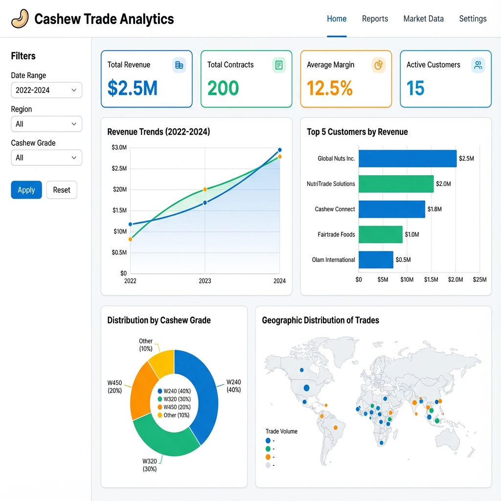

# 🥜 Cashew Trade Analytics

[](https://www.python.org/downloads/)
[](https://opensource.org/licenses/MIT)
[](https://streamlit.io)
[](https://github.com/psf/black)

A comprehensive data analytics platform for analyzing cashew trade contracts, forecasting revenue, and customer segmentation. Built with Python, SQLite, and Streamlit.



## 📖 Overview

This platform helps cashew trading companies:
- 📊 Analyze historical trade data and identify trends
- 💰 Track revenue, margins, and profitability by customer/product
- 🎯 Segment customers using RFM (Recency, Frequency, Monetary) analysis
- 📈 Forecast future revenue using machine learning models
- 🗄️ Manage contract data in a structured SQLite database
- 📱 Visualize insights through an interactive Streamlit dashboard

## ✨ Features

### Data Management
- ✅ Automated data cleaning and validation pipeline
- ✅ SQLite database with optimized schema
- ✅ Support for multiple currencies and incoterms
- ✅ Historical contract tracking

### Analytics & Insights
- ✅ Revenue trends and margin analysis
- ✅ Customer segmentation (RFM Analysis)
- ✅ Product performance metrics
- ✅ Geographic distribution analysis

### Dashboard
- ✅ Interactive Streamlit web application
- ✅ Real-time data filtering and exploration
- ✅ Beautiful visualizations with Plotly
- ✅ Export capabilities for reports

## 🛠️ Tech Stack

- **Language:** Python 3.9+
- **Data Processing:** Pandas, NumPy
- **Database:** SQLite, SQLAlchemy
- **Machine Learning:** Scikit-learn
- **Visualization:** Plotly, Matplotlib, Seaborn
- **Dashboard:** Streamlit
- **Testing:** Pytest
- **Containerization:** Docker

## 🚀 Quick Start

### Prerequisites

- Python 3.9 or higher
- Git
- (Optional) Docker for containerized deployment

### Installation

1. **Clone the repository:**
```bash
git clone https://github.com/tuyetngth2558/cashew-trade-analytics.git
cd cashew-trade-analytics
```

2. **Create and activate virtual environment:**

**Windows:**
```bash
python -m venv venv
venv\Scripts\activate
```

**macOS/Linux:**
```bash
python -m venv venv
source venv/bin/activate
```

3. **Install dependencies:**
```bash
pip install -r requirements.txt
```

### Running with Sample Data

The project includes synthetic sample data for demonstration purposes.

1. **Generate sample data (optional - already included):**
```bash
python scripts/generate_sample_data.py
```

2. **Process data and create database:**
```bash
# Clean and process data
python src/data_processing.py

# Create SQLite database
python src/database.py

# Generate features for ML
python src/features.py
```

3. **Launch the dashboard:**
```bash
streamlit run dashboard/app.py
```

The dashboard will open in your browser at `http://localhost:8501`

## 🐳 Docker Deployment

### Build and run with Docker Compose:

```bash
docker-compose up --build
```

Access the dashboard at `http://localhost:8501`

## 📊 Project Structure

```
cashew-trade-analytics/
├── data/
│   ├── raw/              # Original data files (gitignored)
│   ├── processed/        # Cleaned data (gitignored)
│   ├── sample/           # Sample synthetic data for demo
│   └── database/         # SQLite database files (gitignored)
├── src/
│   ├── data_processing.py   # Data cleaning pipeline
│   ├── database.py          # Database management
│   ├── features.py          # Feature engineering
│   ├── models.py            # ML models
│   └── utils.py             # Utility functions
├── dashboard/
│   └── app.py            # Streamlit dashboard application
├── scripts/
│   └── generate_sample_data.py  # Sample data generator
├── tests/
│   ├── test_data_processing.py
│   ├── test_database.py
│   └── test_integration.py
├── docs/
│   ├── DATA_DOCUMENTATION.md
│   └── DEPLOYMENT.md
├── notebooks/            # Jupyter notebooks for analysis
├── models/              # Trained ML models (gitignored)
├── assets/              # Screenshots and images
├── Dockerfile
├── docker-compose.yml
├── requirements.txt
└── README.md
```

## 📖 Documentation

- **[Data Documentation](docs/DATA_DOCUMENTATION.md)** - Schema, business logic, and usage examples
- **[Deployment Guide](docs/DEPLOYMENT.md)** - Detailed deployment instructions
- **[API Reference](docs/API.md)** - Module and function documentation

## 🧪 Testing

Run the test suite:

```bash
# Run all tests
pytest tests/ -v

# Run with coverage report
pytest tests/ -v --cov=src --cov-report=html

# Run specific test file
pytest tests/test_database.py -v
```

## 📈 Usage Examples

### Load and Analyze Data

```python
from src.database import Database
import pandas as pd

# Initialize database
db = Database('data/database/contracts.db')

# Query top customers
top_customers = db.query("""
    SELECT customer_name, total_revenue, total_contracts
    FROM customer_summary
    ORDER BY total_revenue DESC
    LIMIT 10
""")

print(top_customers)
```

### Generate Insights

```python
from src.features import FeatureEngine

# Create feature engine
fe = FeatureEngine()

# Load data
df = pd.read_csv('data/sample/sample_data.csv')

# Generate RFM features
rfm_df = fe.calculate_rfm(df)
print(rfm_df.head())
```

## 🎯 Roadmap

### Current Version (v0.2.0)
- ✅ Sample data generation
- ✅ Data cleaning pipeline
- ✅ SQLite database
- ✅ Basic Streamlit dashboard
- ✅ Docker support
- ✅ Unit tests

### Planned Features (v0.3.0)
- [ ] Advanced ML models for revenue forecasting
- [ ] Customer churn prediction
- [ ] Automated reporting (PDF/Excel)
- [ ] Real-time data updates
- [ ] User authentication
- [ ] Multi-user support
- [ ] REST API endpoints

## 🤝 Contributing

Contributions are welcome! Please follow these steps:

1. Fork the repository
2. Create a feature branch (`git checkout -b feature/AmazingFeature`)
3. Commit your changes (`git commit -m 'Add some AmazingFeature'`)
4. Push to the branch (`git push origin feature/AmazingFeature`)
5. Open a Pull Request

Please ensure:
- Code follows PEP 8 style guidelines
- All tests pass
- New features include tests
- Documentation is updated

## 📝 License

This project is licensed under the MIT License - see the [LICENSE](LICENSE) file for details.

